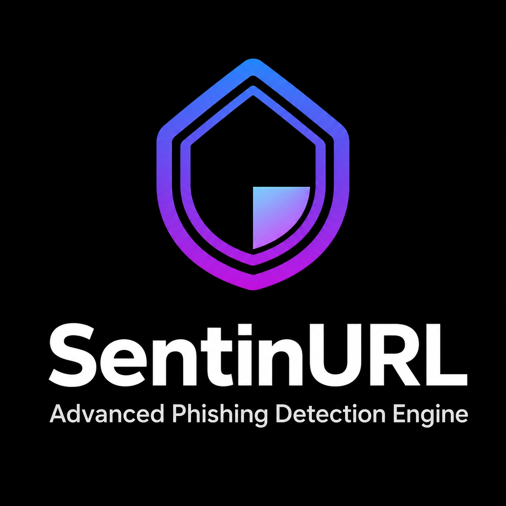

<p align="center">
  
</p>


# SentinURL: AI-Driven Phishing Detection & Risk Intelligence

**Authors**
- Saif Al-Sabaneh, 202330014

**Supervised by:** 
- Dr.Husam Barham

**University:**
- University Of Petra 

**Course:** 
- 307498 – Graduation Project

**Semester:** 
- Second Semester, 2025/2026

**Date:** 
- April 28 , 2026
---

## Abstract
Phishing remains one of the most pervasive and damaging cybersecurity threats, deceiving users into revealing sensitive information through fraudulent URLs. These malicious campaigns lead to significant financial losses, severe data breaches, and compromised infrastructure for both individuals and organizations. As cybercriminals increasingly deploy sophisticated, zero-day phishing techniques that evade traditional blocklists, there is a critical need for advanced, real-time detection systems capable of proactively identifying these evasive threats before they cause harm.

To address this challenge, this project introduces SentinURL, an AI-driven phishing detection system that leverages a multi-stage Machine Learning architecture to neutralize zero-day threats. The implementation utilizes a dual-stage approach: Stage 1 performs high-speed Lexical Intelligence using TF-IDF N-Grams and Calibrated Logistic Regression, while Stage 2 executes deep Structural Fingerprinting using a Histogram-based Gradient Boosting model over 110+ features. A dynamic "Fusion Master Controller" then synthesizes these outputs with live telemetry feeds to resolve conflicts and enforce a strict 0% false-positive rate for established domains.

The evaluation of SentinURL demonstrates highly effective threat detection, achieving a verified global accuracy of 99.55% against zero-day phishing links. By integrating a real-time Google Chrome extension for edge protection and an interactive Streamlit dashboard for Explainable AI (XAI) reporting, the project successfully bridges the gap between complex predictive models and practical cybersecurity applications. The results highlight the system's capability as a reliable, low-latency tool for mitigating the risks associated with modern web-based attacks.

---

## Project Documentation
All detailed academic documentation for this graduation project is maintained as a single comprehensive guide in the `docs/` directory.

### [SentinURL Comprehensive Documentation](docs/SentinURL_Documentation.md)
* [Abstract](docs/SentinURL_Documentation.md#abstract)
* [Acknowledgment](docs/SentinURL_Documentation.md#acknowledgment)
* [Business Intelligence Project Description and Objectives](docs/SentinURL_Documentation.md#business-intelligence-project-description-and-objectives)
* [Data Research and Acquiring Effort](docs/SentinURL_Documentation.md#data-research-and-acquiring-effort)
* [Links to raw data](docs/SentinURL_Documentation.md#links-to-raw-data)
* [Data Description and Understandings](docs/SentinURL_Documentation.md#data-description-and-understandings)
* [Data Primary Cleaning and Transformation](docs/SentinURL_Documentation.md#data-primary-cleaning-and-transformation)
* [Data Visualization and Insights](docs/SentinURL_Documentation.md#data-visualization-and-insights)
* [Advanced Analytics and AI Modeling](docs/SentinURL_Documentation.md#advanced-analytics-and-ai-modeling)
* [Tools Research and Selection Effort](docs/SentinURL_Documentation.md#tools-research-and-selection-effort)
* [Project Deployment Effort – Use Case](docs/SentinURL_Documentation.md#project-deployment-effort--use-case)
* [Core Algorithms and Code Architecture](docs/SentinURL_Documentation.md#core-algorithms-and-code-architecture)
* [Results](docs/SentinURL_Documentation.md#results)
* [References](docs/SentinURL_Documentation.md#references)

### Additional Resources
* [Setup Instructions](docs/SETUP.md)
* [Evaluation Criteria](docs/EVALUATION_CRITERIA.md)

## 💾 Project Datasets
Due to GitHub's file size limitations, the complete datasets used to train the SentinURL models are hosted securely on Google Drive. 
* **Raw URL Dataset:** [data/raw/README.md](data/raw/README.md) (Contains the raw, un-extracted malicious and benign URLs)
* **Processed ML Dataset:** [data/processed/README.md](data/processed/README.md) (Contains the fully structured 110+ mathematical features utilized for training)

---

## 🚀 Performance & Intelligence
*   **Verified Global Accuracy:** **99.55%** (validated against 12,000+ Daily live URLHaus zero-day threats).
*   **Ultra-Low Latency:** < 4ms evaluation time via a optimized Stage 1 NLP engine.
*   **Edge Protection:** Real-time interception via a **Google Chrome Extension (MV3)**.
*   **Quishing Defense:** Integrated QR-code decoding and scanning pipeline.
*   **Fail-Safe Engine:** Reputation-aware absolute overrides to ensure 0% business friction for established domains.

## 🧠 Dual-Stage Neural Architecture
SentinURL utilizes a modular ensemble approach to capture threats that traditional "black-box" models miss.

### **1. Stage 1: Lexical Intelligence (NLP/LogReg)**
Analyzes "What the URL says." Utilizing **TF-IDF N-Grams** and Calibrated Logistic Regression, this layer identifies deceptive language patterns and social engineering keywords at millisecond speeds.

### **2. Stage 2: Structural Fingerprinting (HGB)**
Analyzes "How the URL is built." It evaluates 110+ structural features, including **Shannon Entropy**, subdomain depth, and character distribution using a **Histogram-based Gradient Boosting** model.

### **3. The Fusion Master Controller**
The "Supreme Court" of the system. It synthesizes outputs from both ML stages and live telemetry feeds (GSB, WHOIS, TLS) using a **Structural Bias** logic to resolve conflicts with high precision.

## 📊 Business Intelligence Dashboard
The system includes a professional **Streamlit Command Center** designed for SOC (Security Operations Center) analysts:
*   **Investigative Triage:** Bulk-process URL logs to identify campaign trends.
*   **Explanable AI (XAI):** Visual breakdown of the mathematical reasons behind every block.
*   **Live Threat Intel:** Integration with Global Threat Feeds (URLHaus).
*   **Executive Reporting:** One-click PDF generation for C-suite risk assessment.

## 🛠️ Deployment & Orchestration
*   **Cloud API (Render):** Scalable REST API backend for multi-client protection.
*   **Chrome Extension:** Manifest V3 compliant real-time edge protection.
*   **Continuous Stress Test:** Automated daily health-monitoring and dataset refinement.

## 📥 Getting Started
```bash
# See docs/SETUP.md for detailed instructions
cd src
pip install -r ../requirements.txt
streamlit run streamlit_app.py
```

---
*Securing the digital frontier, one URL at a time.*
