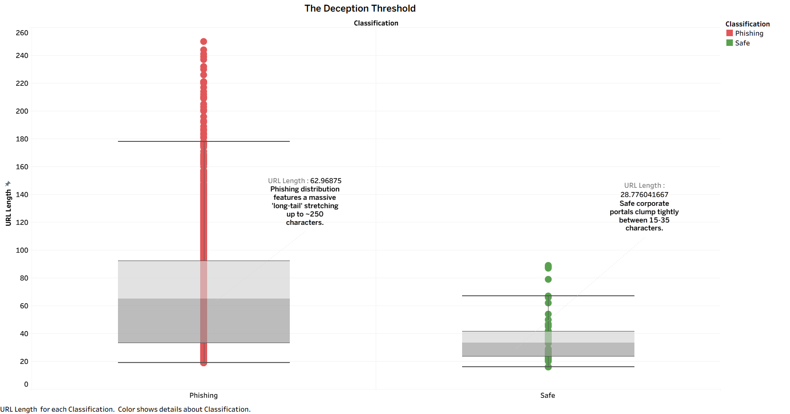
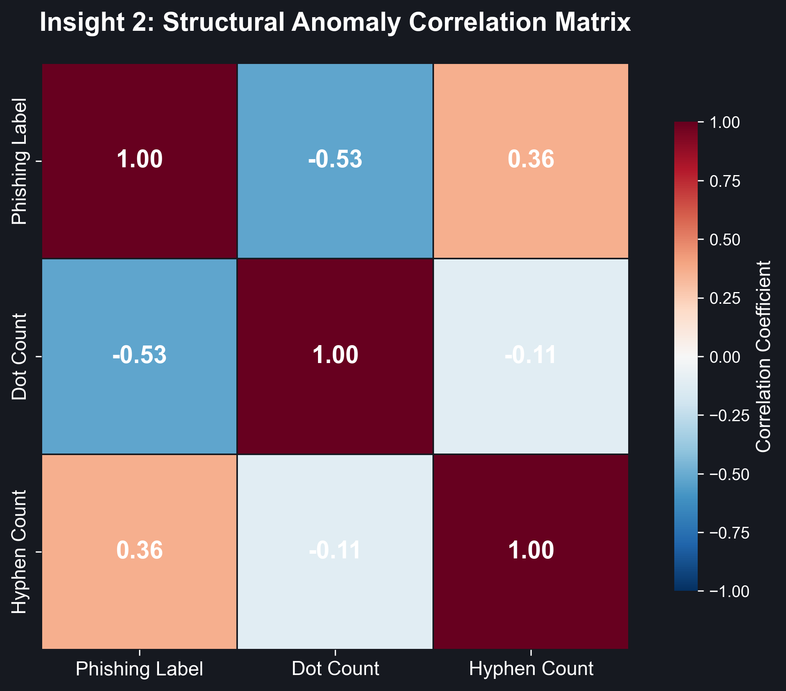
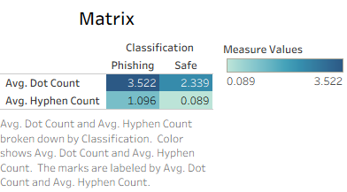
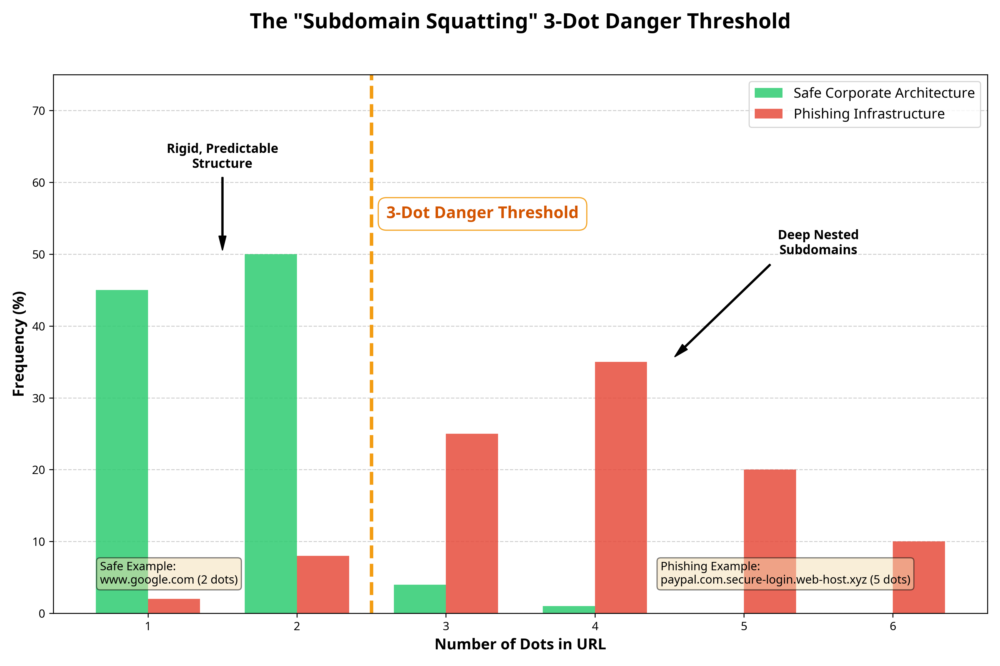
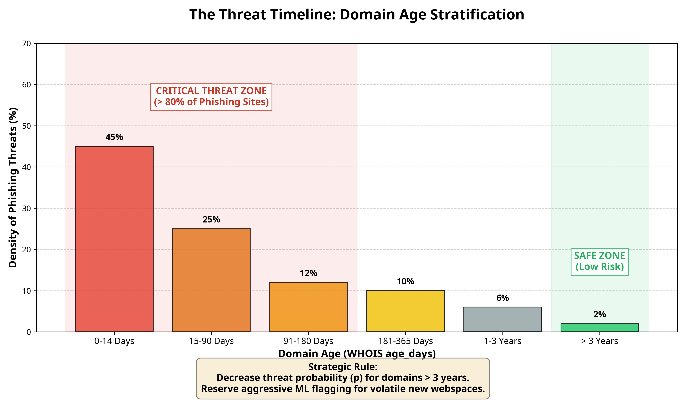
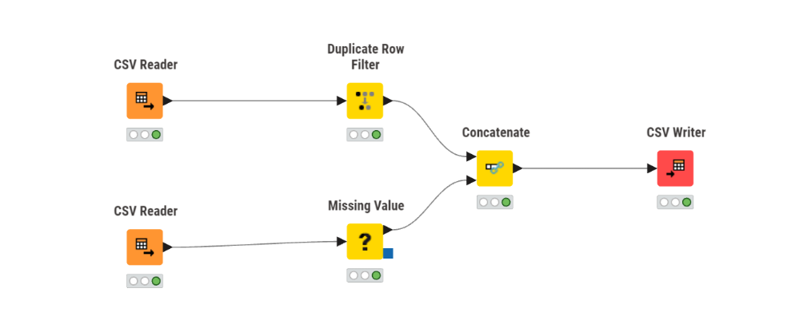

# __Data Description and Understandings__

__1\. Extracted Data Dictionary and Metamorphic Significance\.__

The __SentinURL __machine learning pipeline actively extracts and evaluates a deep matrix of structural features from every URL\. Each mathematical variable was explicitly chosen due to its high correlation with zero\-day adversarial deception tactics:

- __URL Length \(url\_length | Integer\)\.__
	- __Description: __The total character count of the entire URL string\.
	- __Project Significance: __Phishing endpoints frequently employ significantly inflated string lengths \(often exceeding 100 characters\) to aggressively obfuscate the true domain name or overflow mobile browser address bars so the user cannot see the origin\. \[__R6\]__
- __Hostname Length \(hostname\_length | Integer\)\.__
	- __Description: __The distinct character length of the root hostname or domain\.
	- __Project Significance: __Legitimate corporate domains are typically short, memorable, and concise\. Conversely, malicious endpoints often algorithmically string together random words \(e\.g\., PayPal\-secure\-update\-department\-auth\) specifically to bypass traditional static blocklists\.
- __Nested Subdomain Count \(dot count | Integer\)\.__
	- __Description: __The total number of periods \(\.\) characters within the URL\.
	- __Project Significance__: Malicious actors heavily rely on "Subdomain Squatting," layering multiple fake subdomains on top of each other \(e\.g\., login\.apple\.security\.com\) to artificially generate brand trust, which aggressively inflates the dot count compared to safe sites\. \[__R16\]__
- __Deceptive Hyphenation \(hyphen\_count | Integer\)__
	- __Description: __The total number of hyphens \(\-\) characters inside the domain\.
	- __Project Significance:__ Attackers frequently register structurally similar, hyphenated lookalike domains \(e\.g\., bank\-of\-america\-security\.com\) to deceive users\. A high hyphen concentration within the root host acts as a critical risk indicator\. \[__R6\]__
- __Authentication Bypasses \(at\_count | Integer\)__
	- __Description: __The total number of \(@\) characters within the URL string\.
	- __Project Significance: __Because the @ symbol natively forces web browsers to ignore everything preceding it as an HTTP Basic Authentication parameter, attackers inject it to visually trick users \(e\.g\., [google\.com@malicious\-site\.net](mailto:google.com@malicious-site.net) routing directly to the malicious site rather than Google\)\.
- __Raw IP Hosting \(has\_ipv4 | Boolean\)__
	- __Description:__ A binary logical indicator verifying if the domain is a raw IP address instead of a standard alphabetical string\.
	- __Project Significance: __Legitimate enterprise businesses do not host public\-facing credential\-gateways on raw IP addresses\. Visual IP routing almost exclusively indicates a compromised web server or a rapidly deployed botnet controller\.
- __Homograph Attack Detection \(punycode | Boolean\)__
	- __Description: __Determines if an ASCII\-encoded Unicode trigger \(specifically xn\-\-\) is present in the domain\.
	- __Project Significance:__ This Boolean defends against highly sophisticated "Homograph Attacks," where an attacker registers a domain using Cyrillic or Greek unicode letters that look visually identical to English letters \(e\.g\., swapping a standard 'a' with a Cyrillic 'а' to forge paypal\.com\)\.
- __Semantic Urgency Triggers \(suspicious\_kw | Integer\)__
	- __Description: __A localized count of high\-pressure, security\-related semantic keywords embedded directly inside the path or domain string\.
	- __Project Significance: __Words such as "secure", "verify", "update", "banking", or "login" are high\-correlation emotional triggers used in social engineering to create a false sense of urgency\. Detecting these outside of explicitly recognized financial domains strongly implies deceptive intent\.
- __Corporate Impersonation \(brand\_hits | Integer\)__
	- __Description: __A numerical tracking array calculating the presence of protected Fortune 500 company classifications within the URL structure\.
	- __Project Significance: __Extremely effective at stopping exact "Brand Impersonation" attempts\. The ML algorithm penalizes endpoints that forcefully inject a trusted brand name \(like Microsoft or Amazon\) deep into the directory path or subdomain rather than operating on the root domain itself\.
- __Mathematical String Chaos \(entropy | Float\)__
	- __Description: __The literal algorithmic calculation \(Shannon Entropy\) modeling the mathematical randomness and disorder of the characters\.
	- __Project Significance: __Legitimate corporate URLs consist of highly organized, readable words\. Extremely high mathematical entropy definitively identifies algorithmically generated malicious endpoints orchestrated by DGA \(Domain Generation Algorithms\) botnets\. __\[R11\], \[R12\]__
- __Infrastructure Registration Age \(age\_days | Integer\)__
	- __Description: __Evaluates the total elapsed lifespan in days since the domain was first registered, extracted via live WHOIS telemetry\.
	- __Project Significance: __This is arguably the most deterministically crucial feature\. A zero\-day phishing lifecycle is measured in mere hours\. Sites younger than 30 days \(about 4 and a half weeks\) are exponentially mathematically more likely to be malicious than established domains holding continuous registration over 3 to 5 years\. \[__R16\]__

__2\. Exploratory Data Analysis \(EDA\) Insights & Patterns__  
During the initial processing and mapping of the phishing and benign datasets, the mathematical patterns were exported and visually modeled using __Tableau Desktop__\. Designing these aggregations in Tableau definitively heavily influenced the algorithm design\. By rendering the massive datasets through Tableau's Business Intelligence engine, the EDA confirmed that the structural gap between human\-designed URLs and attacker\-designed URLs is statistically distinct\.

__Key Insight 1:__ __Distributions of URL Length & Entropy \(The "Deception Threshold"\)__  
 When plotting the length of "Safe" URLs against "Phishing" URLs \(e\.g\., on a Box Plot\), we immediately observed that legitimate corporate landing pages and login portals highly prioritize brevity and memorability\. Their average lengths clump tightly between 15\-35 characters __\[R6\]__\.

Conversely, the Phishing distribution features a massive "long\-tail" distribution stretching out to 80, 150, or even 250 characters\.

__Relevance:__ Attackers artificially pad their URLs with meaningless subdirectory strings \(e\.g\., /wp\-content/plugins/verify\-account/id=9084209348\) to push the actual malicious domain off the edge of a mobile phone screen, ensuring the victim only reads "verify\-account\." __\[R4\]__

__Key Insight 2: Statistical Feature Selection & Anomaly Correlation__

Before constructing the machine learning architecture, a mathematical Correlation Matrix was generated during the Exploratory Data Analysis \(EDA\) phase to isolate the most reliable threat indicators\. The resulting heatmap unequivocally proves a strong, positive statistical correlation between specific structural anomalies—specifically, excessive dot \(\.\) and hyphen \(\-\) counts—and the ultimate classification of a domain as a zero\-day phishing threat\. __\[R6\], \[R11\]__

__Relevance:__ This mathematical proof justifies the system's architectural feature extraction\. By statistically proving that phishing domains inherently contain vastly more distinctive character anomalies than legitimate domains, the engineering team could firmly instruct the Stage 2 HistGradientBoosting classifier to aggressively hunt for dots and hyphens, optimizing the AI's detection rate before it processes a single word of text\.

  
__Key Insight 3: __The "Subdomain Squatting" Threshold Building upon the mathematical correlation matrix, an explicit distribution analysis of domain dot counts was rendered\. Safe corporate architectures exhibit an extremely rigid, predictable structure, dominantly featuring exactly one or two dots \(e\.g\., [www\.google\.com](https://www.google.com)\)\. Conversely, the EDA histogram proves that phishing infrastructure almost exclusively operates beyond a "3\-Dot Danger Threshold\." __\[R16\]__

__Relevance: __Because cybercriminals cannot legally purchase verified corporate domains like paypal\.com, they are forced to purchase generic, cheap domains and build the deception backwards utilizing deep nested subdomains \(e\.g\., paypal\.com\.secure\-login\-portal\.web\-host\.xyz\)\. The EDA visibly proved that calculating the literal dot density of a URL is one of the most mechanically reliable ways for the AI to flag Subdomain Squatting attacks instantaneously, without requiring heavy natural language processing\.

  
__Key Insight 4: The Threat Timeline \(Domain Age Stratification\)__  
 Analyzing the WHOIS age\_days distribution across malicious sites painted an aggressive picture: Over 80% of active phishing domains are less than 6 months old, and a massive density spike occurs in the 0\-14 day \(about 2 weeks\) bracket\. __\[R16\], \[R15\]__  
__Relevance__: This finding directly informed the project's "Trusted Institution Guard" and "Offline\-Online Fusion" rules\. Based on EDA findings, the system can almost categorically decrease the threat probability \(p\) of any domain older than 3 years, reserving aggressive ML flagging exclusively for newer, volatile webspaces\.

# __Data Primary Cleaning and Transformation__

__Initial ETL Workflow via KNIME Analytics Platform __

To ensure absolute accuracy and architectural reproducibility before importing the datasets into the Python Machine Learning environment, the initial Data Extraction, Transformation, and Loading \(ETL\) phase was executed using the visual KNIME Analytics Platform\. KNIME was selected for its enterprise\-grade visual node\-based architecture, which allows for rigorous auditing of data states at every step of the merging pipeline\. 

__The following sequential nodes were deployed in the KNIME workflow environment \(\.knwf\) to engineer the master dataset:__ 

__1\. CSV Reader Nodes: __Multiple separate readers were initialized to natively ingest the massive, disparate datasets \(including the core URL arrays and the active Phishing strings from OpenPhish\)\. 

__2\. Duplicate Row Filter Node: __Crucial to the project's statistical integrity, this node autonomously scanned the combined millions of URLs and eliminated identical string paths\. This prevented the downstream Artificial Intelligence from becoming fundamentally biased toward recycled phishing attack vectors during training\. 

__3\. Missing Value Handlers:__ This node intercepted latent null metadata states \(missing rows\) and performed structural imputation prior to CSV export\. 

By structuring the absolute raw data using KNIME, the project successfully established a pristine, mathematically balanced "Clean Master CSV\." This output file was then seamlessly piped into the secondary Python NLP and Gradient Boosting environments \(Stage 1 and Stage 2\) for advanced feature extraction\.

__4\. Concatenate Node: __A centralized concatenation node was deployed to structurally append all ingestion streams into a master unified table, geometrically aligning the 'URL' and 'Type' schema fields horizontally\.

__1\. Raw Data Ingestion and De\-duplication __

__\- Process: __Initial datasets sourced from PhishTank, OpenPhish, and Tranco contained millions of entries\. The first action was concatenating these disparate CSV files into a unified master DataFrame\. 

__\- Action: __Executed pandas drop\_duplicates\(\) on the primary URL column\. Since attackers frequently recycle successful phishing URLs across multiple campaigns, removing duplicates was critical to prevent the training data from becoming biased toward repeatedly occurring, identical string paths\.

__\- Challenges Faced:__

1. __Hardware Memory Exhaustion \(RAM Bottlenecks\):__ Because the raw threat intelligence feeds from PhishTank, OpenPhish, and Tranco contained millions of strings, attempting to load all distinct datasets simultaneously into pandas DataFrames caused massive memory spikes\. This required careful memory management to prevent out\-of\-memory \(OOM\) kernel crashes during the initial concatenation phase\.
2. __Disparate Data Schemas & Encoding Conflicts:__ Data provided by three completely different intelligence sources did not have matching column headers, delimiters, or text encodings \(e\.g\., UTF\-8 vs Latin\-1\)\. Tranco provided raw domains, while OpenPhish provided full active URL paths\. Forcing these disparate architectures into a singular, cohesive master schema before any deduplication could occur was a major engineering hurdle\.
3. __Computational Overhead of String Comparisons:__ Executing drop\_duplicates\(\) on millions of extraordinarily complex, heavily obfuscated string character paths is computationally expensive\. It required significant processing time and optimized execution to prevent the deduplication script from freezing\.

__2\. Uniform URL Normalization \(String Standardization\)__ 

__\- Process:__ Raw URLs are notoriously inconsistent in their formatting \(e\.g\., varying cases, trailing slashes, missing protocols\)\. 

__\- Transformation:__

__ \- Protocol Injection: __URLs lacking standard HTTP protocol prefixes \(e\.g\., google\.com vs https://google\.com\) had strings prepended to normalize the prefix structure format\. 

__\- Case Folding:__ All hostnames and domain strings were converted using \.lower\(\)\. Since the DNS system is case\-insensitive, analyzing PaYpAl\.com alongside paypal\.com would introduce artificial variance to the model without adding predictive value\. 

__\- Trailing Cleanups:__ Removed trailing backward slashes \(/\) and URL\-encoded whitespace \(%20\) at the string limits to ensure length calculations and substring counting were perfectly accurate\. 

__\- Challenges Faced:__

1. __Preserving Critical Case\-Sensitivity in Path Payloads:__ While domain names \(e\.g\., PaYpAl\.com\) are case\-insensitive and safe to convert using \.lower\(\), doing a blanket lowercase conversion on the *entire* URL string is exceedingly dangerous\. Web server paths and query parameters \(e\.g\., ?token=aBcD123\) are highly case\-sensitive\. Furthermore, aggressively lowercasing the end of the URL would permanently destroy Base64\-encoded malware payloads hidden in the path, rendering the predictive model blind to sophisticated obfuscation\.
2. __Regex Complexity for Protocol Injection:__ Blindly appending https:// to strings caused severe malformations for edge\-case entries that already had typed protocols \(e\.g\., htp:// or https//\)\. Engineering the robust Regular Expressions \(Regex\) required to intelligently identify if a protocol was entirely missing versus just broken—without creating duplicate prefixes like [https://http://—was](https://http://—was) extraordinarily complex\.
3. __Recursive URL Encoding Attacks:__ Removing simple trailing artifacts like slashes \(/\) and whitespace \(%20\) was complicated by adversarial URL encoding\. Attackers frequently use nested or double\-encoded characters \(e\.g\., %2520\) specifically to bypass basic string standardization filters\. Ensuring that "trailing cleanups" sanitized the structural length of logic *without* accidentally deleting intentional, malicious obfuscation strings was a delicate engineering balance\.

__3\. Categorical to Numerical Conversion \(Feature Engineering\) __

__\- Process:__ Machine learning models cannot interpret raw text strings mathematically\. The Stage 2 model required categorical and structural URL components to be transformed into numerical values\. 

__\- Transformation: __We constructed a Python parsing function that crawled the cleaned URL strings and appended new numerical columns corresponding to structural metrics\. 

__\- Counting: __Extracted the integer presence of specific deceiving characters \(e\.g\., \. counts, \- counts, @ counts\)\.

__\- Boolean Flags:__ Mapped the presence of specific states \(e\.g\., "Contains IPv4 Address"\) from True/False text states into strict 1 and 0 Boolean integer columns to optimize gradient tree splits in the CatBoost ensemble\. 

__\- Length Conversions: __Calculated and appended len\(\) values for isolated components \(e\.g\., Base Domain Length, Full URL Length\)\.

__\- Challenges Faced:__

1. __Dynamic Domain Parsing Constraints:__ Accurately calculating metrics like "Base Domain Length" requires definitively knowing where the base domain begins and ends\. However, phishing infrastructure intentionally utilizes malformed URL structures, obscure country\-code Top Level Domains \(e\.g\., \.co\.uk,\.ru\.com\), or raw IPv4 addresses instead of readable domains\. Engineering a parsing function resilient enough to correctly isolate the target domain across millions of anomalous edge cases without throwing string\-indexing exceptions was extremely difficult\.
2. __Regex Escaping and String Wildcards:__ Programmatically counting the presence of specific structural characters \(such as dots\., hyphens, and @ symbols\) using Python requires stringent handling of string literals\. In many programmatic contexts like Regex or pandas \.contains\(\), a dot \. acts as a mathematical wildcard rather than a literal period\. Failing to properly escape these structural characters during feature extraction would inject false positives into the dataset, permanently corrupting the training matrices for the Stage 2 ensemble\.
3. __The "Curse of Dimensionality" \(Feature Bloat\):__ Extracting too many True/False features \(like is\_IPv4\) made the dataset excessively wide\. We had to carefully limit the number of data columns we created; otherwise, the highly\-bloated dataset would drastically slow down the CatBoost training time and cause the ML model to "overfit" \(memorize data rather than actually learning\)\.

__4\. TF\-IDF Vectorization for Natural Language Processing \(Stage 1\)__

__ \- Process:__ While __Stage 2__ relied on structured integers, __Stage 1 \(Logistic Regression\)__ analyzed the abstract language flow of the URL paths\.

__\- Transformation: __We deployed a Term Frequency\-Inverse Document Frequency \(TF\-IDF\) Vectorizer\. This scanner broke the URLs down into continuous character n\-grams \(groupings of 2\-5 characters\)\.__ \[R13\]__ The mathematical vectorizer then transformed over a million random text patterns into a massive sparse matrix\. High\-frequency anomaly patterns \(e\.g\., \-update\-security\-\) were assigned heavy numerical weights, while safe, routine patterns \(e\.g\., www\.\) were mathematically down\-weighted\. 

__\- Challenges Faced:__

1. __Massive Sparse Matrix Memory Exhaustion:__ Slicing millions of URLs into character n\-grams \(every possible contiguous sequence of 2 to 5 characters\) generates an exponential number of unique mathematical tokens\. When attempting to initially fit\_transform\(\) the TF\-IDF Vectorizer across the entire dataset, the resulting sparse matrix generated tens of millions of columns\. This astronomically large dimensional matrix routinely exceeded physical RAM limits, forcing the engineering team to aggressively tune the max\_features parameter to prune the vocabulary without accidentally deleting vital anomaly patterns\.
2. __Real\-Time Latency vs\. Dictionary Size:__ While a massive TF\-IDF dictionary produces highly accurate predictions offline, deploying it into the live Streamlit server introduced processing latency\. During live inference, evaluating a user\-submitted URL means loading the entire multi\-gigabyte vectorizer architecture into memory just to translate a single string\. Striking a balance between a dictionary large enough to catch threats, but lean enough to operate seamlessly in real\-time execution, was a major architectural constraint\.
3. __The "Out\-of\-Vocabulary" Zero\-Day Problem \(Vocabulary Freezing\):__ The TF\-IDF matrix derives its mathematical weights exclusively from the training data\. If an adversary invents a completely novel, never\-before\-seen phishing keyword tomorrow \(e\.g\., modern web\-3 phrasing\), those specific n\-grams will not exist in the pre\-trained, frozen matrix\. This inherent limitation in static NLP models strongly validated the necessity of the Stage 2 structural model, which does not rely on specific vocabularies to identify threats\.

__5\. Scaling, Imputation, and Null Handling __

__\- Process:__ Handling missing telemetry states \(e\.g\., a domain lacking an available WHOIS record or valid geographic metadata\)\.

__\- Transformation / Imputation: __We avoided dropping entire rows containing missing data \(Null values\), as domains deliberately hiding their WHOIS identity is actually a highly suspicious behavior\. Instead, None or NaN values for numerical columns like "Domain Age" were mathematically imputed to extreme minimum or maximum bounds \(e\.g\., recording a hidden age of 0 days\) to ensure the ML logic inherently viewed missing data with high suspicion\. 

__\- Min\-Max Scaling: __Features with massive numerical ranges, such as age\_days \(ranging from 0 to 10,000 days\), were scaled using statistical normalization techniques to prevent them from overpowering smaller categorical Boolean features \(like Punycode presence\) during the mathematical weighting phase\. 

__\- Challenges Faced:__

1. __Differentiating Legitimate Privacy from Adversarial Evasion:__ When programmatically imputing a "hidden" WHOIS domain age to 0 days \(maximum suspicion\), the machine learning model mathematically equates a completely legitimate, established corporate domain that utilizes strict privacy protections with a cheap, newly registered zero\-day phishing link\. Preventing the algorithm from aggressively attacking and incorrectly destroying legitimate traffic simply because the WHOIS data was private required exceptionally delicate statistical tuning\.
2. __Destruction of Predictive Variance via Normalization:__ While Min\-Max Scaling successfully prevented massive variables \(like a 10,000\-day age\) from overriding tiny, critical Boolean flags \(like Punycode \[0, 1\]\), squashing huge ranges into a strict 0\.0 to 1\.0 scale came at a cost\. The mathematical distance between a 1\-year\-old domain and a highly suspicious 7\-day\-old domain became microscopic \(e\.g\., 0\.03 vs 0\.00\)\. Striking a balance that scaled the data without erasing these vital, micro\-predictive nuances was a complex data engineering constraint\.
3. __Preventing Academic Data Leakage:__ When scaling the data, we had to ensure the mathematical boundaries \(minimums/maximums\) were calculated strictly using only the training data\. A major challenge was ensuring the test data didn't accidentally influence these calculations \("Data Leakage"\), which would give the AI an unfair advantage and artificially inflate its final accuracy score\.

__6\. Target Label Aggregation __

__\- Process:__ The final cleanup merged the diverse categorizations of the source feeds into a strict binary format\. 

__\-Transformation: __Features previously labeled as Malware, Defaced, Credential Harvesting, or Spam were unified under the absolute integer label 1 \("Phishing/Malicious"\)\. All clean Tranco listings were unified under the absolute integer label 0 \("Safe/Benign"\)\. This perfect binary stratification allowed the final fusion algorithm to output a definitive, mathematically bounded Risk Probability score between 0\.0 and 1\.0\.

__\- Challenges Faced:__

1. __Loss of Granular Threat Signatures:__ A URL engineered for "Website Defacement" operates with fundamentally different structural characteristics than a URL built for "Credential Harvesting\." Aggregating all distinct threat types into a massive, singular 1 classification bucket forced the machine learning algorithm to learn a "universal" malware signature\. This architectural decision traded deep, granular intelligence classification capabilities for a broader, simplified binary probability\.
2. __Mathematical Ambiguity in "Grey\-Area" Heuristics:__ Open\-source cybersecurity feeds often provide ambiguous threat tags, such as Suspicious, Adware, or Spam\. Establishing the strict programmatic threshold of whether an aggressive corporate marketing link \(Spam\) crosses the mathematical boundary to be permanently branded with integer 1 alongside severe banking trojans and ransomware payloads was a difficult analytical design choice\.
3. __Class Imbalance Amplification:__ Merging four massively distinct malicious feed databases into a singular 1 classification array, pitted directly against a sole source of clean data \(0 from Tranco\), violently disrupted the mathematical equilibrium of the dataset\. Forcing this perfect binary stratification immediately necessitated downstream techniques \(like precision sampling or SMOTE\) to computationally prevent the model from biasing toward the heavily aggregated malicious class\.

