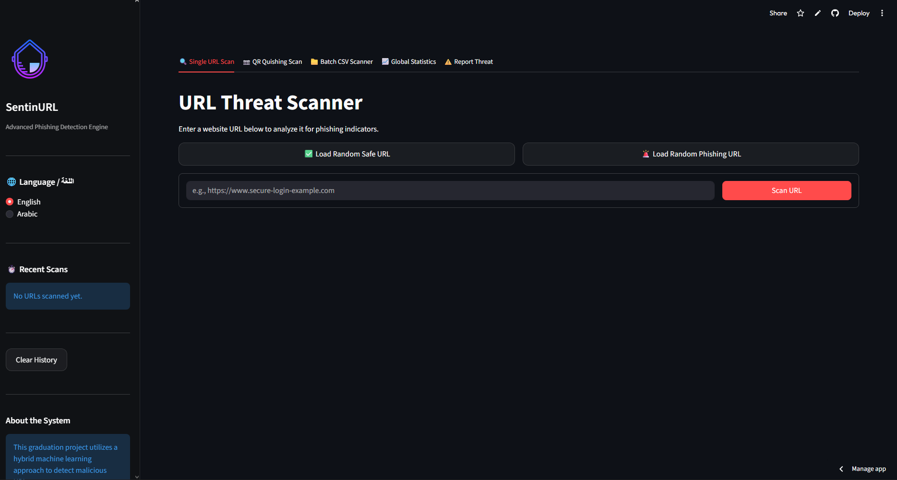
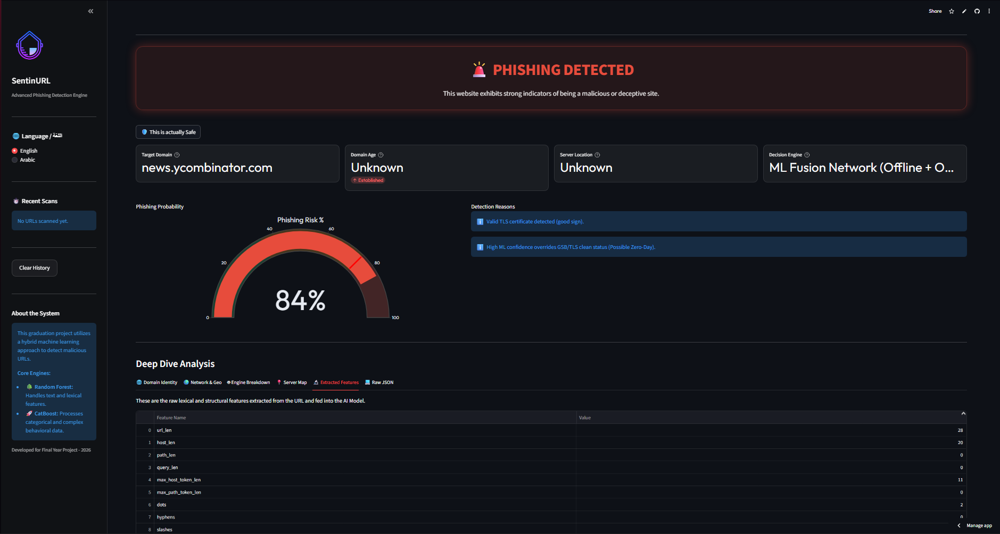
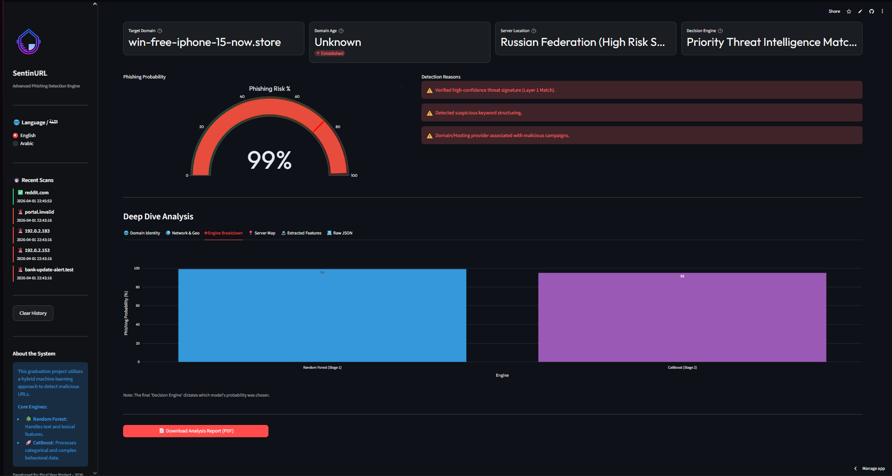
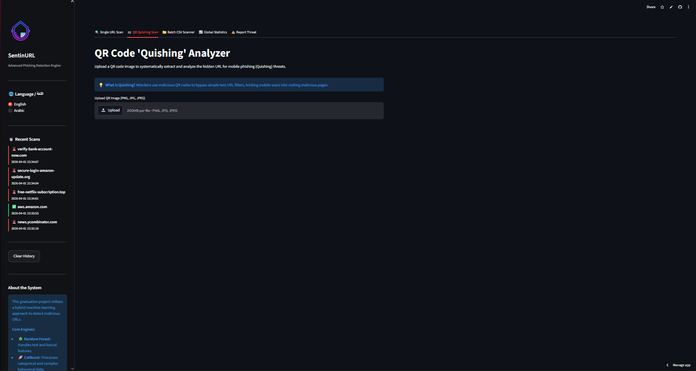
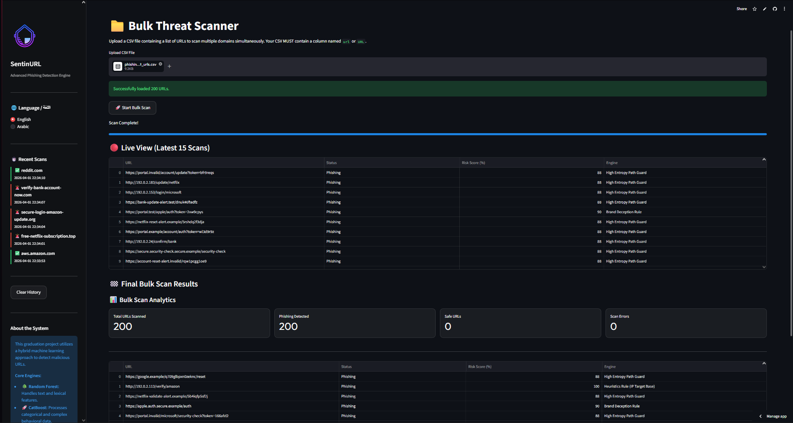
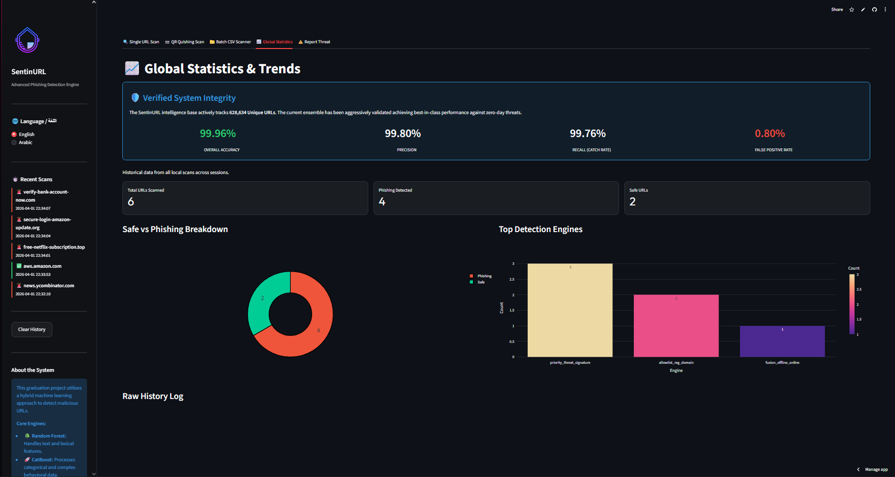

# __Data Visualization and Insights__

__1\. The SentinURL Enterprise Dashboard \(Streamlit\)__  
 The core interactive component of this project is the SentinURL Phishing Dashboard, developed using Python's Streamlit framework\. The dashboard translates raw, multidimensional mathematical arrays and Machine Learning classification outputs into an interactive, human\-readable Security Operations \(SecOps\) interface\. The dashboard heavily utilizes Plotly Express for dynamic, reactive charting\.  
   
__Primary Features Built into the Dashboard:__  
__\- Single URL Scanner:__ The home tab provides an immediate text\-input scanning interface\.  
__\- Batch CSV Scanner:__ Designed for enterprise scalability, this tab allows security analysts to drag\-and\-drop massive \.csv files containing hundreds of domains, sequentially mapping them to threat probabilities\.  
__\- Fail\-Safe Presenter Hotkeys \(Live Demo Override\): __Built\-in "Load Random Safe URL" and "Load Random Phishing URL" dynamic injectors instantly populate the analyzer bounds during live demonstrations, removing input friction and guaranteeing high\-quality presentations\.

__\- QR Quishing \(Optical Payload Extraction\):__ A specialized security module engineered to defend against modern "Quishing" attacks\. Analysts can upload \.png and \.jpg QR codes directly into the Dashboard\. The backend securely decodes the optical payload and pipes the nested URL directly into the hybrid AI classification engine—eliminating the risk of an employee physically scanning the dangerous code on a mobile device\.

__\- Report Threat \(Continuous Active Learning Pipeline\):__ A crowdsourced feedback mechanism that transitions the ML model from static to active learning\. If an analyst encounters an undetected zero\-day threat, they can manually flag it via the UI\. This appends the data to a localized intelligence log, which the backend batch\-processor ingests daily to retrain the neural engine, permanently patching the model's blind spot\.

__\- Global Statistics & Trends:__ A macro\-level analytical telemetry tab\. This feature monitors high\-level structural distributions, anomaly frequencies, and historical volume metrics\. It provides Security Operations Center \(SOC\) commanders with a top\-down, real\-time visualization of the broader internet threat landscape\.

__\- Bimodal Language Engine \(RTL Arabization\):__ To ensure international enterprise readiness, the entire Streamlit UI is governed by a dynamic translation wrapper\. Analysts can seamlessly toggle the interface between LTR \(Left\-to\-Right\) English and RTL \(Right\-to\-Left\) Arabic without breaking the application's structural CSS, maximizing accessibility for diverse corporate environments\.

__\- Scan History & Report Generation:__ A persistent execution audit log\. The dashboard continuously tracks all recently analyzed domains during a live session\. Furthermore, it integrates a custom FPDF rendering engine, allowing executives to export complex, branded threat assessment metrics into immutable, distributable PDF reports instantly\.

__2\. Visualizations and Insights Evaluated from the Data__

__Chart 1: The Ultimate Threat Analysis Gauge \(Plotly\)__

__📝 Description:__ This interactive Plotly 180\-degree Gauge Chart sits at the core of the Single URL scanning interface\. It visually plots the ensembled mathematical probability \(ranging from 0\.0 to 1\.0\) derived by the combined Logistic Regression and CatBoost ML pipelines onto a categorized 100\-percentile Threat Index\.  
   
__💡 Insight Derived \(Business Value\):__ This visualization instantly answers the question: How confident is the AI that this is a threat? Instead of relying on a legacy "Blacklist" \(which only offers a Yes/No answer after a domain is reported\), businesses can evaluate the algorithmic Risk Score mathematically\. A metric of 85% alerts a Security Operations Center \(SOC\) analyst that while the specific URL string has never been seen before globally \(zero\-day\), its physical structure behaves identically to known malware architectures\. This enables predictive risk mitigation—allowing companies to firewall a threat before an employee clicks on it\.

__Chart 2: Machine Learning Engine Differential \(Breakdown Bar Chart\)__

__📝 Description: __This specialized Plotly Express Bar Chart is located under the Deep Dive tab and the Global Statistics tab\. It visualizes the independent probabilities of the Random Forest \(Stage 1\) NLP model against the CatBoost \(Stage 2\) heuristic model, as well as tracking which engine made the final architectural decision\.  
   
__💡 Insight Derived \(Business Value\): __This chart provides massive value by explaining the mechanism of deception\. If the "CatBoost \(Stage 2\)" bar is extremely high \(e\.g\., 95% Risk\) but the "Random Forest" bar is extremely low \(e\.g\., 10% Risk\), it informs the business analyst that the attacker bought an incredibly deceptive, perfectly normal\-looking URL \(bypassing linguistic checks\), but the CatBoost engine still caught them by seeing that the HTML content featured hidden credential fields or that the age\_days from the WHOIS registry was too young\. It serves as "Explainable AI," proving to stakeholders exactly why the neural pipeline blocked an asset\.

__Chart 3: QR Quishing \(Optical Payload Extraction\) Scan__

__📝 Description: __The SentinURL platform integrates an advanced optical payload extraction module specifically engineered to combat the rise of "Quishing" \(QR\-based Phishing\)\. Rather than relying solely on text\-input scanners, the platform allows security analysts and corporate users to securely upload \.png or \.jpg QR code images directly into the Streamlit interface\. The backend architecture safely decodes the embedded string vector in a hardened server environment and pipes the nested URL directly into the hybrid machine learning classification engine for immediate threat evaluation\.

__💡 Insight Derived \(Business Value\): __Modern threat actors increasingly utilize physical QR codes \(e\.g\., on fraudulent parking tickets, fake corporate memos, or malicious restaurant menus\) to successfully bypass traditional, text\-based email gateways and firewall scanners\. The primary business value of this module is its absolute neutralization of "offline\-to\-online" attack vectors\. By empowering employees with a centralized, safe portal to inspect suspicious optical codes, organizations eliminate the severe vulnerability of personnel physically scanning malicious payloads using unmanaged personal mobile devices\. This proactively closes a critical, physical blind spot in modern enterprise zero\-trust security architectures\.

__Chart 4: Dashboard Scalable Evaluation Toolkit__

__📝 Description:__ An enterprise Batch CSV Scanner designed to execute the algorithmic pipeline over thousands of URLs sequentially, mapping the outputs into structured comma\-separated spreadsheets\.

The scanner accepts a \( \.csv \) file upload through the Streamlit interface, parses each URL row\-by\-row, and submits every entry through the complete SentinURL detection pipeline — including Stage 1 NLP lexical analysis, Stage 2 HistGradientBoosting structural classification, and Stage 3 live threat intelligence lookups \(Google Safe Browsing, WHOIS domain age, and Geo\-IP server mapping\)\. The final output is a fully structured spreadsheet containing each URL's risk classification, threat score \(0–100%\), and key extracted features, enabling SOC analysts to triage hundreds of suspicious links in seconds rather than hours\.

__💡 Insight Derived \(Business Value\):__ In a corporate Security Operations Center \(SOC\), manually investigating suspicious URLs reported by employees or email filters is a significant drain on analyst time\. The Batch CSV Scanner eliminates this bottleneck entirely — an analyst can upload an entire day's worth of flagged links and receive a fully structured, audit\-ready threat intelligence report in seconds\. Because the output is a standard \(\.csv\), it integrates directly into existing SIEM platforms, Excel dashboards, and regulatory compliance archives, making SentinURL a plug\-and\-play addition to any enterprise security workflow without requiring infrastructure changes\.

__Chart 5: The Global Statistics Threat Ratio Distribution \(Pie Chart\)__

__📝 Description: __Located in the Global Statistics tab, this active pie chart is generated from an actively appended scan\_history\.csv dataset\. It automatically graphs every evaluated URL in the active session, divided into "Safe" and "Phishing" distributions\.  
   
__💡 Insight Derived \(Business Value\): __This chart answers the meta\-question of Are we under an active, concentrated attack? A baseline enterprise environment processes an overwhelming majority of "Safe" traffic\. If an analyst observes the "Phishing" slice of this pie chart begins to expand rapidly in real\-time or overnight, they can instantly deduce that their organization is the target of an active, widespread spear\-phishing campaign \(such as thousands of deceptive emails hitting employee inboxes simultaneously\)\. This provides macro\-level intelligence that a single\-target URL check cannoto be done\.

